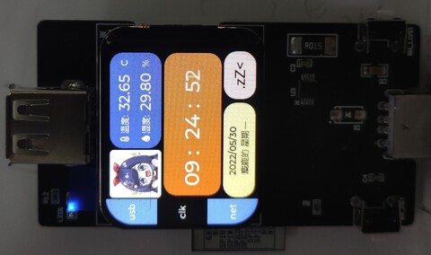

# esp32c3-usbVCSensor

基于ESP32C3+LVGLv8的USB电压电流传感器

USB voltage and current sensor based on ESP32C3+LVGLv8. English version of the documentation is under development

 

## 文档结构

- docs : 文档
- Hardware : 原理图和pcb文件 可直接送[嘉立创](https://www.jlc.com/)打样
- pcSimulate : 运行在windows上 使用LVGL官方模拟器进行修改的UI界面(UI模拟)
- Software : ESP32C3运行的软件 (使用vscode进行开发)

## 特色功能 （大概）

- ESP32c3 作为主控 (160MHz/运存384Kb/4M容量)
- INA226 作为电流电压传感器 (16位ADC/双向电流采样/高精度测量)
- SHT31-DIS 作为温湿度传感器 (0-100%湿度范围/宽温度范围/高灵敏度)
- 彩屏UI使用LVGL v8 、 st7789驱动
- 使用MQTT协议进行数据传输
- SmartConfig(EspTouch)和NVS进行连网操作
- 物料成本在RMB120以内(含PCB)

## 使用说明

### 原理框图

### UI说明

 

### MQTT说明

软件使用MQTT/TCP方式连接MQTT代理(broker)。连接地址的格式为mqtt://example.url 默认端口为1883

推荐使用MOSQUITTO作为MQTT代理

ESP32C3默认会在 ${ESP32ROOT}/status 位置创建一个持久的遗嘱消息 （offline）用于指示当前的运行情况，连接上MQTT代理后，会使用另一条消息 "online" 覆盖掉该遗嘱

${ESP32ROOT} 为 MQTT_UNIQUE_ID 的值，该值可使用 kconfig 在vscode中定义

当前使用的mqtt消息

${ESP32ROOT}/status   --- 查看当前esp32c3的状态

${ESP32ROOT}/menu/tabview   --- esp32c3将会订阅该消息，用于切换esp32c3显示的tabview

${ESP32ROOT}/usb/voltage  --- esp32c3将会推送该消息，以字符串形式发送当前测量的电压

${ESP32ROOT}/usb/current --- esp32c3将会推送该消息，以字符串形式方式发送当前测量的电流

${ESP32ROOT}/clk/temperature   --- esp32c3将会推送该消息，以字符串形式发送当前测量的温度

${ESP32ROOT}/clk/humidity   --- esp32c3将会推送该消息，以字符串形式发送当前测量的湿度

### 硬件说明

硬件上留有两个用于DEBUG的跳线电阻(0603封装)，位置如下图所示。当焊接上时，等于ESP32C3的内建USB模块连接到下方的USB公头，可以使用USB公头进行ESP32C3的程序烧录和调试等工作，当程序烧录完成后，需要将该位置的两个条线断开，否则会导致快充协议无法识别或其他USB从设备的连接。

板子上设计了两个按键，从正面看，

- 左边的按键是SW_RST，用于ESP32C3的复位

- 右边的按键是SW_LOAD，在启动阶段，用于选择ESP32C3的启动模式（若同时按下SW_RST和SW_LOAD将导致ESP32进入下载模式从而无法正常启动）；在工作阶段，充当用户IO，用于切换当前显示的屏幕

电源方案上兼容两套电源方案，分别是芯洲科技的SCT2400TV(推荐)和TI的LMR14010。
- 当使用SCT2400TV时，不需要焊接二极管D1且应选择较小的电阻R8
- 当使用LMR14010时，必须焊接二极管D1。